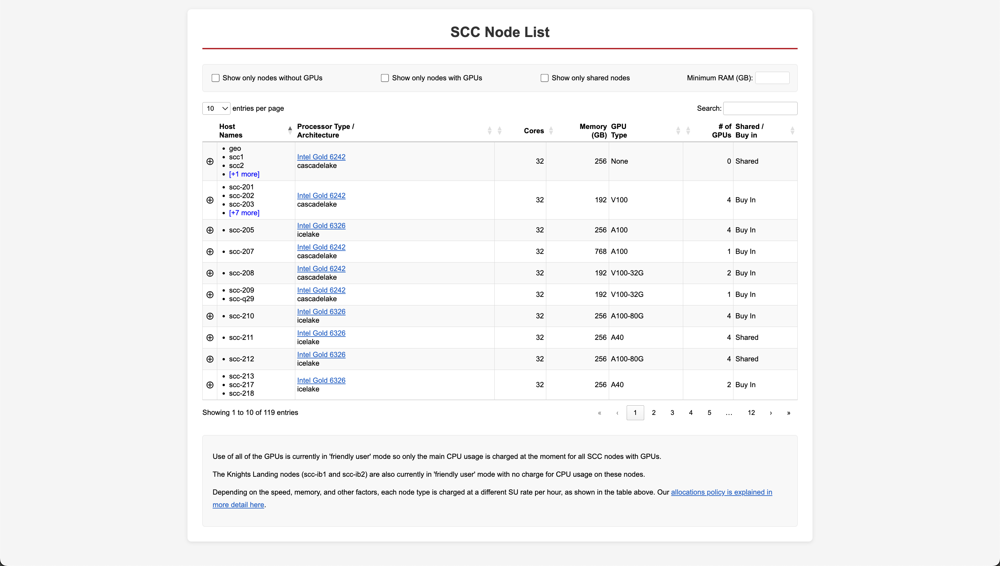

# SCC Node List Display

A web-based interface for displaying technical information about compute nodes in a university's Shared Computing Cluster (SCC). The system provides an interactive, filterable table of cluster resources including CPU specifications, memory, GPU information, and node availability.


## Overview

This project consists of:
- **Python script** (`build_data.py`) - Processes node data and generates a JavaScript data file
- **HTML interface** (`table.html`) - Interactive web page with DataTables for browsing cluster nodes
- **Extra information file** (`extrainfo.csv`) - Additional notes for specific nodes
- **Generated data file** (`data.js`) - JavaScript file containing formatted node data

## Features

- **Interactive filtering**: Filter nodes by GPU availability, shared/buy-in status, and minimum RAM
- **Expandable details**: Click to reveal full node specifications and special notes
- **Hostname expansion**: View complete lists of nodes in each configuration group
- **Responsive design**: Clean, professional interface optimized for readability
- **Automatic grouping**: Nodes with identical specifications are grouped together
- **CPU documentation links**: Direct links to manufacturer specification pages

## Setup and Usage

### Prerequisites

- Python 3 with pandas installed
- Access to the cluster nodes data file at `/projectnb/rcsmetrics/nodes/data/nodes.csv`
- Web server to host the HTML file (or open locally in a browser)

### Running the Script

On the cluster, navigate to the project directory and run:

```bash
module load python3
python3 build_data.py
```

This will:
1. Load node data from the CSV file
2. Merge additional notes from `extrainfo.csv`
3. Filter for active nodes only
4. Group nodes by identical specifications
5. Generate `data.js` with formatted data for the web interface

### Automated Updates

The script is designed to run via cron job for periodic updates when the underlying node data changes. Ensure the cron job:
- Runs from the correct directory (where `data.js` should be saved)
- Has access to the required Python modules
- Has read permissions for the source data files

### Viewing the Interface

Open `table.html` in a web browser. The page will automatically load data from `data.js` and display the interactive node table.

## File Descriptions

### `build_data.py`

Python script that:
- Reads cluster node data from CSV
- Merges additional node-specific notes
- Filters for active nodes
- Groups nodes by configuration (CPU, cores, memory, GPUs, etc.)
- Maps CPU model names to display-friendly versions with specification links
- Exports formatted data as JavaScript array

**Key grouping columns:**
- Processor type and architecture
- Core count
- Memory (RAM)
- GPU type, count, compute capability, and memory
- Network speed
- Shared vs. buy-in status

### `table.html`

Interactive web interface featuring:
- DataTables-powered sortable, searchable table
- Custom filters for CPU-only, GPU-only, shared nodes, and minimum RAM
- Expandable detail rows showing complete node information
- Collapsible hostname lists for node groups
- Responsive styling with BU color scheme

### `extrainfo.csv`

CSV file containing special notes for specific nodes:
- Login nodes (no SU tracking, no batch jobs)
- Knights Landing nodes (friendly user mode)
- VirtualGL nodes
- Globus transfer nodes

### `data.js`

Auto-generated JavaScript file containing node data in the format:
```javascript
const data = [
  [hostnames, processor_type, cores, memory, gpu_type, gpus, flag, extra_info],
  ...
];
```

**Do not edit this file manually** - it will be overwritten on the next script run.

## Data Sanity Check

The script includes a basic sanity check that verifies:
- At least 100 node groups are generated
- Login nodes (e.g., `scc1`) are present in the data

If the check fails, the script exits without updating `data.js` to prevent serving stale or corrupted data.

## Customization

### Adding New CPU Models

To add CPU specification links, update the `cpu_display_map` dictionary in `build_data.py`:

```python
cpu_display_map = {
    'Model-Name': '<a href="URL" target="_blank">Display Name</a>',
    # ...
}
```

### Adding Node Notes

Add entries to `extrainfo.csv`:

```csv
host,notes
hostname,"Note about this node"
```

### Modifying Filters

Edit the filter controls section in `table.html` to add custom filtering options. Update the DataTables search extension accordingly.

## Dependencies

### Python
- pandas
- json (standard library)

### Web (CDN-loaded)
- jQuery 3.7.1
- DataTables 2.3.2

## Maintenance

- **Data updates**: Ensure the source CSV at `/projectnb/rcsmetrics/nodes/data/nodes.csv` is kept current
- **Note updates**: Modify `extrainfo.csv` as needed when node purposes change
- **Style updates**: Edit the `<style>` section in `table.html` for appearance changes
- **Cron scheduling**: Adjust cron frequency based on how often node data changes

## Notes

- GPU usage is currently in "friendly user" mode with no charges
- Knights Landing nodes (scc-ib1, scc-ib2) have no CPU usage charges
- Different node types have different SU rates based on specifications
- The interface is optimized for displaying 100+ node configurations
